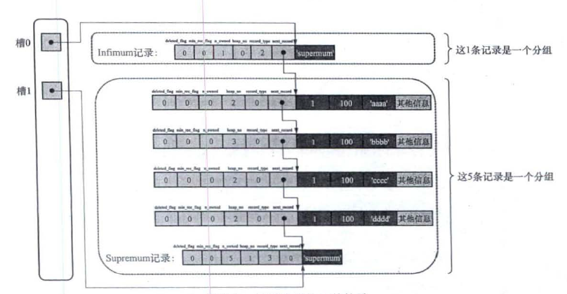

MySQL架构
---------------


MySQL可以分为三层结构, 最外层是网络层, 负责处理客户端连接, 授权认证等操作. 中间层是核心服务, 包括解析器, 优化器, 查询缓存和内置函数. 最底层是存储引擎, 负责数据的存储和提取. 

MySQL提供了不同的存储引擎, 并且通过中间层屏蔽了底层的差异. MySQL在解析查询语句时, 会对查询语句进行优化. 优化器不关心底层使用什么存储引擎, 但不同的存储引擎可能影响优化结果, 因此优化器会向存储引擎请求容量, 某个操作的开销信息, 表数据的统计信息来辅助优化过程. 用户可以通过特殊关键字提示优化器, 从而影响优化器的选择. 用户也可以要求优化器解释优化操作的因素.


> 从MySQL 8.0开始, 查询缓存已经被删除. [MySQL为什么取消了Query Cache?](https://cloud.tencent.com/developer/article/1693427)


MySQL中常见的存储引擎有InnoDB, MyISAM和MEMORY. 从MySQL 5.5.5开始, InnoDB作为MySQL默认的存储引擎, 在此之前MyISAM作为默认的存储引擎. MySQL支持的存储引擎如下所示

```
mysql> show engines;
+--------------------+---------+----------------------------------------------------------------+--------------+------+------------+
| Engine             | Support | Comment                                                        | Transactions | XA   | Savepoints |
+--------------------+---------+----------------------------------------------------------------+--------------+------+------------+
| MEMORY             | YES     | Hash based, stored in memory, useful for temporary tables      | NO           | NO   | NO         |
| MRG_MYISAM         | YES     | Collection of identical MyISAM tables                          | NO           | NO   | NO         |
| CSV                | YES     | CSV storage engine                                             | NO           | NO   | NO         |
| FEDERATED          | NO      | Federated MySQL storage engine                                 | NULL         | NULL | NULL       |
| PERFORMANCE_SCHEMA | YES     | Performance Schema                                             | NO           | NO   | NO         |
| MyISAM             | YES     | MyISAM storage engine                                          | NO           | NO   | NO         |
| InnoDB             | DEFAULT | Supports transactions, row-level locking, and foreign keys     | YES          | YES  | YES        |
| BLACKHOLE          | YES     | /dev/null storage engine (anything you write to it disappears) | NO           | NO   | NO         |
| ARCHIVE            | YES     | Archive storage engine                                         | NO           | NO   | NO         |
+--------------------+---------+----------------------------------------------------------------+--------------+------+------------+
```

> XA表示是否支持分布式事务, Savepoints表示是否支持部分回滚


InnoDB是MySQL默认的事务存储引擎, 它被设计用来处理大量短期事务, 此类事务的特点是大部分时候事务都正常提交, 很少被回滚. InnoDB较小的性能开销和自动崩溃恢复使功能得非事务任务中也可以考虑使用InnoDB来提高数据的安全性. 


字符集
-------------

MySQL支持的字符集如下所示, 其中比较少见的字符集已经从表格中删除

```
mysql> show charset;
+----------+---------------------------------+---------------------+--------+
| Charset  | Description                     | Default collation   | Maxlen |
+----------+---------------------------------+---------------------+--------+
| ascii    | US ASCII                        | ascii_general_ci    |      1 |
| gb2312   | GB2312 Simplified Chinese       | gb2312_chinese_ci   |      2 |
| gbk      | GBK Simplified Chinese          | gbk_chinese_ci      |      2 |
| latin1   | cp1252 West European            | latin1_swedish_ci   |      1 |
| latin2   | ISO 8859-2 Central European     | latin2_general_ci   |      1 |
| utf16    | UTF-16 Unicode                  | utf16_general_ci    |      4 |
| utf32    | UTF-32 Unicode                  | utf32_general_ci    |      4 |
| utf8     | UTF-8 Unicode                   | utf8_general_ci     |      3 |
| utf8mb4  | UTF-8 Unicode                   | utf8mb4_0900_ai_ci  |      4 |
+----------+---------------------------------+---------------------+--------+
```

**latin1编码**又被称为ISO 8859-1编码, 这一编码在ASCII编码的基础上, 扩展了高位的128个编码, 收录了西欧的常用字符.

**utf8编码**是MySQL自带的只使用3字节的编码方式, 可能导致一些UTF-8收录的字符无法显示.

**utf8mb4编码**对应真正的UTF-8编码, 出于减少存储乱码的考虑, 实际生产环境中应该优先使用此编码.

> collation定义了字符的顺序和对比规则, 通常无需关注此选项

### 各级别字符集

MySQL服务器端默认的字符集和比较规则如下所示, 可以看到在当前的MySQL中已经将真正的UTF-8编码作为默认的字符集编码了.

```
mysql> show variables like 'character_set_server';
+----------------------+---------+
| Variable_name        | Value   |
+----------------------+---------+
| character_set_server | utf8mb4 |
+----------------------+---------+

mysql> show variables like 'collation_server';
+------------------+--------------------+
| Variable_name    | Value              |
+------------------+--------------------+
| collation_server | utf8mb4_0900_ai_ci |
+------------------+--------------------+
```

----------

MySQL支持多种层次上指定字符编码, 例如

```sql
-- 在创建数据库时指定编码
CREATE DATABASE dbtest CHARACTER SET utf8mb4 COLLATE utf8mb4_0900_ai_ci;

-- 在创建表的时候指定编码
CREATE TABLE t(
    col VARCHAR(10)
) CHARACTER SET utf8mb4 COLLATE utf8mb4_0900_ai_ci;

-- 在创建列时指定编码
CREATE TABLE t(
    col VARCHAR(10) CHARACTER SET utf8mb4 COLLATE utf8mb4_0900_ai_ci
);

-- 在创建列时指定编码
ALERT TABLE t MODIFY col VARCHAR(10) CHARACTER SET gbk COLLATE gbk_chinese_ci;
```

如果在以上所有层次都不指定编码, 则会使用服务器级的值作为默认值. 不同版本的MySQL可能使用不同的默认编码, 因此通常还是需要在创建数据库时明确指定编码格式.


InnoDB行格式
------------------

相比于内存读写的速度, 硬盘读写的速度要慢几个数量级, 因此如何高效的从硬盘上读写数据是数据库需要解决的一个重要问题. InnoDB支持四种不同的行格式, 以下分别简单介绍一下四种格式的存储结构

### COMPACT格式

COMPACT格式的结构如下所示: 

```
| 变长字段列表 | NULL值列表 | 记录头信息 | 列1的值 | 列2的值 | ... | 列n的值 |
```

**变长字段列表**: 存储记录中各个变长字段实际占用的长度信息. 例如`VARCHAR(10)`表示最多可存储10个字符, 但实际可能只写入了3个字符. MySQL需要知道实际写入的字符数.

**NULL值列表**: 记录每一行记录中值为NULL的字段, 每一个列使用一个二进制位表示是否为NULL. 由于SQL语法可以规定某个列不可为NULL, 因此NULL值列表可以不存在.

> 由于字节对齐的需要, 二进制位使用不足一字节的部分还是会占用一字节.

**记录头信息**: 这一部分占5字节, 主要是一些标记信息.

**隐藏列**: 除了上述的信息以外, 每一行还会包含一些隐藏信息, 这些信息被称为隐藏列, 具体包括

名称             | 是否必须  | 占用空间   | 含义
----------------|-----------|-----------|------------
DB_ROW_ID       | 否        | 6字节     | 行ID      
DB_TRX_ID       | 是        | 6字节     | 事务ID        
DB_ROLL_PTR     | 是        | 7字节     | 回滚指针   

> 没有主键时, MYSQL才会自动生成DB_ROW_ID

### 补充: 变长字段的长度

假设在某个数据集中, 一个字符最多需要`W`个字节表示, 对于变长类型`VARCHAR(M)`而言, 这表示最多可以存储`M`个字符, 因此该字段最多可能占用`MxW`个字节, 假设其实际占用的字节数为`L`, 则

1) 判断该列最大存长度是否超过1字节表示范围, 即`MxW < 255`, 如果不超过该范围, 则可以使用1字节安全的存储该可变字段的长度.
2) 否则根据实际占用字节数`L`, 使用1字节或2字节存储该字段的长度. 如果`L <= 127`则使用1字节表示, 否则使用2字节表示.

MySQL可通过表结构得知一个字段是否可以存储超过255字节, 之后可以通过分析这一字节的最高位是否为1得知是否使用了2字节表示长度

> 从变长字段的数据结构可以得到一个非常有趣的结论, 如果对其进行长度变更, 且变更前后不会使得表示长度的字段变化(从1字节变2字节或者反向操作), 那么本次变更只需要修改元数据, 实际存储结构不变. 但如果长度字段发生变化, 那么就需要逐一修改每一条记录, 将会产生非常大的操作时间.
> [实测变更操作是否会锁表](https://blog.csdn.net/yuanlairuci1992/article/details/126886422)

-----------

对于固定长度类型, 例如`CHAR(M)`, 如果使用的字符集是固定长度, 则字段占用的空间也是固定大小. 但如果**字符集**是变长的, 则此时`CHAR(M)`类型为了实现性能与空间的平衡, 实际也是变长的,并且至少分配M字节的空间.

例如`CAHR(10)`在utf8字符集上分配的空间就是10~30字节, 且至少为10字节. 相对地, 如果是`VARCHAR(10)`, 那么分配的最小空间就是0字节. 这一设置一方面减少了空间的浪费, 同时又预留了一定的空间, 减少了页面分裂的概率.


### REDUNDANT格式

REDUNDANT格式的细节如下所示:

```
| 字段长度偏移列表 | 记录头信息 | 列1的值 | 列2的值 | ... | 列n的值 |
```

字段长度偏移列表: 记录了之后每个字段在记录内的偏移地址

记录头信息: 这一部分占6字节, 主要是一些标记信息.

----------------

如果整个记录的长度小于127字节,  则使用1字节表示偏移量, 否则全部采取2字节存储偏移量. 对于定长类型, 直接分配最大的空间, 并且使用零填充. 对于变长类型, 由于记录了偏移值, 因此如果为NULL则不占据任何空间. 

> REDUNDANT格式主要在早期的MySQL中使用, 当前已经基本不采取此格式了

### 补充: 溢出页

由于InnoDB按照页的格式存储数据, 而InnoDB的一页的大小一般为16KB, 因此当存储的一行数据就超过了一个页面长度时, 则无法在一个页中存储一条记录。

对于这种情况，无论是COMPACT格式还是REDUNDANT格式都会使用溢出页进行存储，即在这一行记录中只会存储前768个字节以及一个20字节的溢出页指针. 多余的数据会存储到溢出页中. 需要访问数据时，通过溢出页指针找到剩余的数据存储的位置。

> MYSQL规定每个页至少需要存储两条数据(溢出页不受此规则的约束), 是否产生溢出页主要取决于字段类型和编码集. 


### 其他行格式

剩余的两种格式是DYNAMIC格式和COMPRESSED格式，这两种格式与COMPACT格式比较类似，但DYNAMIC格式处理溢出数据时不会存储前768个字节, 而是直接存储指针. 而COMPRESSED格式在DYNAMIC格式的基础上还会使用压缩算法对页面进行压缩. 

> 目前DYNAMIC格式是MYSQL的默认格式


InnoDB数据页格式
-----------------------

在上一节介绍了一行数据是按照什么格式存储到MySQL之中的, 而在MySQL中数据是按照页作为单位存储的, 其中每个数据页的大小都是固定的16KB, 扣除一些页面的信息以外, 剩余的空间就按照行格式存储数据, 具体如下

名称                | 长度       | 详细信息
--------------------|-----------|---------------------------
File Header         | 38 Byte   | 文件头, 数据页的通用信息
Page Header         | 56 Byte   | 页面头：数据页的专有信息
Infimum + Supremum  | 26 Byte   | 两个虚拟记录
User Records        | N/A       | 用户的实际记录
Free Space          | N/A       | 剩余的可用空间
Page Directory      | N/A       | 页面中某些记录的相对位置
File Trailer        | 8 Byte    | 校验

其中`User Records`存储实际的行数据, `Free Space`占据剩余的可用空间. 从逻辑上看, MySQL数据行在数据页内应该按照主键的大小顺序存放, 但实际为了保证插入效率, 并不会真的移动数据并插入. 在物理存储上, 每一个数据行通过一个偏移字段指向下一行记录的位置, 从而使得这些记录构造一个类似链表的结构.

显然, 基于链表的模式对于查询将会产生较大的解析和遍历成本, 因此一个较为直观的想法是构建类似跳跃表的结构, 加速记录的定位, 因此实际的链表结构如下所示



其中`Infimum`和`Supremum`是两条虚拟的记录, 用于表示最小和最大的记录. `Page Directory`承担了类似跳跃表的功能, 用户的数据首先分割为不同的槽, 每个槽中可以包含4~8条数据, 页目录中存储了每个槽中最大的记录在页面中的偏移地址. 


### 其他部分

`Page Header`和`File Header`用于存储数据页的专有信息和通用信息,  其中`File Header`还承担了链接不同数据页的功能, 通过双向链表链接上一个数据页和下一个数据页.

`File Trailer`部分存储的是校验值, 校验值在文件头部也有存储, 这一部分的目的是为了防止将数据写入磁盘的过程中断电导致记录只有一半被刷新的情况. 在这种情况下通过对比头部的校验值与尾部的校验值是否一致即可判断页面是否完全刷新. 


MySQL数据目录
---------------------


通过查询如下的变量可以知道MySQL当前的数据目录位置:

```
mysql> show variables like 'datadir';
+---------------+---------------------------------------------+
| Variable_name | Value                                       |
+---------------+---------------------------------------------+
| datadir       | C:\ProgramData\MySQL\MySQL Server 8.0\Data\ |
+---------------+---------------------------------------------+
```

访问这一目录可以发现, 其中每个数据库在这里都对应了一个文件夹, 而每个表都在对应的文件夹内对应了一个IDB文件


Buffer Pool
-------------------

由于磁盘速度远低于CPU速度, 因此MySQL的InnoDB会将硬盘上的页缓存到内存之中, 从而减少IO操作的耗时.  可以通过如下的指令查看Buffer Pool的大小

```
mysql> show global variables like 'innodb_buffer_pool_size';
+-------------------------+---------+
| Variable_name           | Value   |
+-------------------------+---------+
| innodb_buffer_pool_size | 8388608 |
+-------------------------+---------+
```

Buffer Pool以页作为基本单位, 一个页面的大小也是16KB, 与硬盘上的页一一对应. 除了页以外, Buffer Pool中还包含一些控制信息, 包括记录页面基本信息的控制块以及free链表和flush链表. 

> free链表记录那些页是空闲的, flush链表记录那些页等待刷新

当需要判断一个页是否已经被缓存时, MySQL使用表空间号和页号作为key, 使用哈希表直接定位. 

### LRU链表

Buffer Pool作为一个缓冲区, 其核心问题就是如何提高缓存命中率. 使用LRU算法进行页替换是一种常规操作. 但在此基础上, MySQL还需要做一些优化. 

MySQL中有预读取机制, 即当某些页面满足一定的条件后, 会异步的读取后续的页面到Buffer Pool之中, 如果预读取的页面后续被用到了, 则可以极大的提高效率. 但如果后续的页面没有被用到, 则会导致大量页面进入Buffer Pool, 将其他频繁访问的页面挤出.  此外如果执行了全表扫描, 也会导致大量页面进入Buffer Pool, 挤出其他频繁访问的页面. 

针对上面的问题, MySQL引入了分区设置, 将Buffer Pool分为两个区域, 一部分存储较热的数据, 而另一部分存储较冷的数据, 从而使得预读取和全表扫描不会挤占热点数据的页面. 

### 查看信息

使用`show engine innodb status`可以查看相关的信息

```
----------------------
BUFFER POOL AND MEMORY
----------------------
Total large memory allocated 136970240
Dictionary memory allocated 443780
Buffer pool size   8192
Free buffers       7134
Database pages     1048
Old database pages 387
Modified db pages  0
Pending reads      0
Pending writes: LRU 0, flush list 0, single page 0
Pages made young 0, not young 0
0.00 youngs/s, 0.00 non-youngs/s
Pages read 851, created 197, written 862
0.00 reads/s, 0.00 creates/s, 0.00 writes/s
No buffer pool page gets since the last printout
Pages read ahead 0.00/s, evicted without access 0.00/s, Random read ahead 0.00/s
LRU len: 1048, unzip_LRU len: 0
I/O sum[0]:cur[0], unzip sum[0]:cur[0]
```


