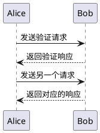
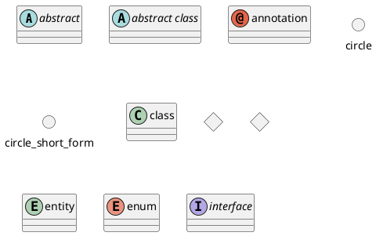
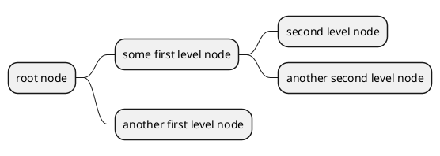

<!-- <script type="text/javascript" src="https://cdnjs.cloudflare.com/ajax/libs/mathjax/2.7.4/MathJax.js?config=default"></script> -->


PlantUML是一个开源项目, 提供了用代码绘制时序图, 类图, 对象图等功能. 由于代码编辑更加便利, 因此在博客和文档中都非常适合使用PlantUML来插入对应的图片. PlantUML的[官方文档](https://plantuml.com/zh/)上对每种图的特性都进行了详细的描述. 在必要的时候, 也可以通过[在线服务器1](http://www.plantuml.com/plantuml/uml/SyfFKj2rKt3CoKnELR1Io4ZDoSa70000)和[在线服务器2](https://www.planttext.com/)直接导出对应的图片.

时序图
--------------



时序图有三类重要的元素, 分别是

- 角色(Actor) / 对象(Object)
- 生命线(Lifeline)和焦点(Activation)
- 消息

角色就是字面意思, 通常在图中使用一个小人表示. 对象可以是系统中的一个组件, 也可以是代码中的某个模块. 角色和对象是时序图的基础结构.

时序图中每个对象和底部中心都有一条垂直的虚线, 这就是对象的生命线(对象的时间线). 控制焦点代表时序图中在对象时间线上某段时期执行的操作. 以一个很窄的矩形表示. 


- [程序员必备画图技能之——时序图](https://www.cnblogs.com/54chensongxia/p/13236965.html)
- [Sequence Diagram 官方文档](https://plantuml.com/en/sequence-diagram)


类图
----------

类图的目标非常明确, 就是用来绘制Java中各种类的关系图. 类图中的很多属性与Java类的属性都是一一对应的.



- [Class Diagram 官方文档](https://plantuml.com/en/class-diagram)
- [UML类图详解](https://www.jianshu.com/p/38489621d218)
- [认识 UML 类关系——依赖、关联、聚合、组合、泛化](https://blog.csdn.net/K346K346/article/details/59582926)


思维导图
----------------

```
@startmindmap
* root node
	* some first level node
		* second level node
		* another second level node
	* another first level node
@endmindmap
```



注意:
- 思维导图处于beta阶段, 后续语法可能发生更改
- 语法与Markdown列表语法兼容, 但只能使用`*`且缩进必须使用`tab`


E-R图的设计
-----------------------


### 概念设计原则
1. 实体与属性的划分
	- 能作为属性对待的, 尽量作为属性对待, 以简化E-R图
	- 属性必须是原子的
	- 使用原始属性, 而不是导出属性(计算结果)
2. E-R图合成
	1. 合并
		- 解决E-R图之间的冲突
	2. 修改和重构
		- 消除不必要的冗余, 生成基本E-R图

### E-R图向关系模型的转化
1. 一个实体型转化为一个关系模式
	- 关系的属性: 实体的属性
	- 关系的码: 实体的码
2. 1:1联系
	1. 转化为一个独立的关系模式
		- 关系的属性: 与该联系相联的个实体的码以及关系本身的属性
		- 关系的候选码: 每个实体的码均是该关系的候选码
	2. 与某一端实体对应的关系模式合并
		- 合并后的关系的属性: 加入对应关系的码和联系本身的属性
3. 1:n联系
	- 转化为一个独立的关系模式
		- 关系的属性:与该联系相联的个实体的码以及关系本身的属性
		- 关系的码:n端实体的码
	- 与n端对应的关系模式合并
		- 合并后关系的属性:在n端关系中加入1端关系的码和联系本身的属性
		- 由于可以减少关系数量, 一般倾向于这种方法
4. m:n联系
	- 转化为一个关系模式
	- 关系的属性:与该联系相联的各实体的码以及联系本身的属性
	- 关系的码: 各实体码的组合
5. 三个或以上实体间联系
	- 转化为一个关系模式
	- 与m:n联系转化方法一致
6. 关系的合并
	- 具有相同码的关系模式可以合并
	- 需要合并一些同义属性(可能同名也可能不同名) 
