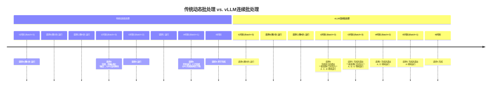

“本文是一次有趣的‘自指实验’——所有内容均由大语言模型生成，包括这段声明。它试图以‘机器之语’探讨‘机器之思’，愿你在阅读中既能看见技术的可能，亦能觉察其创造的边界。” 本博客全文（含上述引言）内容均为大语言模型生成的文本，仅供思考与探讨。

- [BBPE算法](#bbpe算法)
  - [1. **基本原理**](#1-基本原理)
  - [2. **实现步骤**](#2-实现步骤)
  - [3. **与BPE的区别**](#3-与bpe的区别)
  - [4. **优缺点**](#4-优缺点)
  - [5. **应用场景**](#5-应用场景)
- [针在干草堆中测试](#针在干草堆中测试)
    - [**1. 定义与目的**](#1-定义与目的)
    - [**2. 典型应用场景**](#2-典型应用场景)
    - [**3. 测试设计方法**](#3-测试设计方法)
    - [**4. 技术挑战与模型表现**](#4-技术挑战与模型表现)
    - [**5. 与其他测试的对比**](#5-与其他测试的对比)
    - [**6. 实际应用案例**](#6-实际应用案例)
    - [**7. 当前模型的局限性**](#7-当前模型的局限性)
  - [**总结**](#总结)
- [模型蒸馏](#模型蒸馏)
  - [为什么知识蒸馏是有效的](#为什么知识蒸馏是有效的)
- [Contamination Issue](#contamination-issue)
  - [**1. 数据污染（Data Contamination）**](#1-数据污染data-contamination)
  - [**2. 模型污染（Model Contamination）**](#2-模型污染model-contamination)
  - [**3. 预处理污染（Preprocessing Contamination）**](#3-预处理污染preprocessing-contamination)
  - [**如何避免污染问题？**](#如何避免污染问题)
  - [**示例**](#示例)
- [大语言模型部署](#大语言模型部署)
  - [🚀 核心四步：快速启动一个服务](#-核心四步快速启动一个服务)
  - [💻 在Python代码中直接使用](#-在python代码中直接使用)
  - [🔧 关键参数与生产优化](#-关键参数与生产优化)
  - [📈 进阶：生产部署与监控](#-进阶生产部署与监控)
- [vLLM高性能原理](#vllm高性能原理)
  - [⚙️ vLLM高性能的三大核心技术](#️-vllm高性能的三大核心技术)
  - [📊 传统动态批处理 vs. vLLM连续批处理](#-传统动态批处理-vs-vllm连续批处理)
  - [💎 总结与对部署的启示](#-总结与对部署的启示)


BBPE算法
-------------

Byte-level Byte-Pair Encoding（BBPE）是BPE（Byte-Pair Encoding）算法的改进版本，核心思想是将文本处理粒度从字符级别扩展到**字节级别**，通过UTF-8编码支持多语言文本的分词。以下是其关键点：

### 1. **基本原理**
BBPE基于BPE框架，但初始词表由**256个字节**（0-255）构成，而非字符。文本通过UTF-8编码转换为字节序列后，算法统计相邻字节对的频率，逐步合并高频对以构建子词词表。例如：中文“你好”的UTF-8字节表示为`\xe4\xbd\xa0\xe5\xa5\xbd`，BBPE会统计这些字节对的频率并合并高频组合（如`\xe4\xbd`和`\xa0`）。

### 2. **实现步骤**
1. **初始化词表**：包含所有256个可能的字节。
2. **统计频率**：统计训练语料中相邻字节对的出现频率。
3. **合并高频对**：选择频率最高的字节对合并为新子词，更新词表。
4. **迭代合并**：重复上述步骤，直到达到预设词表大小或无法继续合并。

### 3. **与BPE的区别**
| 对比项          | BPE                          | BBPE                          |
|-----------------|------------------------------|-------------------------------|
| **初始词表**    | 字符级别（如字母、汉字）      | 字节级别（256个UTF-8字节）     |
| **处理粒度**    | 字符（如“a”、“汉”）           | 字节（如`\xe4`、`\xbd`）       |
| **多语言支持**  | 需为不同语言单独训练词表      | 通用，支持任意语言混合文本     |
| **OOV处理**     | 可能无法处理罕见字符          | 无OOV（所有字符可分解为字节）  |

传统的BPE存在分析统一性问题，不同语言的字符集差异大（如中文汉字 vs 英文字母），需为每种语言单独训练词表，导致多语言模型词表臃肿且难以共享子词。对低频字符（如罕见汉字、特殊符号）容易触发OOV。

### 4. **优缺点**
- **优点**：
  - **多语言通用性**：通过字节处理，无需为不同语言设计单独词表。
  - **无OOV问题**：任何字符均可通过UTF-8编码为字节序列。避免模型在遇到**未在训练词表中出现过的词汇**时，无法正确表示或处理这些词汇的现象。
- **缺点**：
  - **计算复杂度高**：初始词表较大（256字节相较于26个字母），合并次数多。
  - **语义信息弱**：字节级合并可能生成无明确语义的子词。

### 5. **应用场景**
BBPE广泛应用于多语言模型（如GPT系列、Qwen系列），因其能统一处理混合语言文本，例如：
- 英文单词“chat”和中文“聊天”分别编码为字节序列后，BBPE可生成共享子词（如`\x68\x61`对应“ha”）。

总结来看，BBPE通过字节级处理实现了更强的通用性，是当前多语言模型分词的主流方法之一。


针在干草堆中测试
-------------------------

#### **1. 定义与目的**
**“针在干草堆中”测试**是一种用于评估机器学习模型（尤其是大语言模型）在**长文本中定位关键信息**能力的基准测试。其核心思想是模拟从海量无关信息（“干草堆”）中精准提取特定目标信息（“针”）的场景，检验模型的**长上下文理解**、**信息检索**和**抗噪声干扰**能力。

#### **2. 典型应用场景**
- **长文本问答**：测试模型能否从数万字的文档中回答依赖特定细节的问题。  
  *示例*：在一篇100页的研究报告中，要求模型找到“实验组样本量”的具体数值。
- **噪声鲁棒性**：评估模型在冗余或干扰信息中保持准确性的能力。  
  *示例*：在包含大量无关对话的文本中，定位关键事件的时间点。
- **多语言/跨模态处理**：测试模型对混合语言、代码或结构化数据的敏感度。  
  *示例*：从混杂中英文的会议纪要中提取中文提到的项目预算。

---

#### **3. 测试设计方法**
1. **构造“干草堆”**：  
   - 生成或选取长文本（通常数万至数十万token），内容包含冗余、重复或无关信息。
   - 可插入多种干扰类型：随机段落、无关对话、多语言混合、代码片段等。

2. **插入“针”**：  
   - 在文本的随机位置插入目标信息（“针”），如特定事实、数值、日期或短句。
   - 可能设计多根“针”以测试多目标检索能力。

3. **设计问题**：  
   - 提问需直接关联“针”的内容，但避免使用与“针”完全相同的表述。  
   *示例*：  
   - 插入内容：“项目最终成本为\$2.14亿”（针）  
   - 提问：“本次项目的总支出是多少？”

4. **评估指标**：  
   - **准确率**：模型能否返回“针”中的正确答案。  
   - **响应速度**：模型处理长文本的效率（如token/秒）。  
   - **抗干扰性**：插入“针”的位置（开头/中间/结尾）对结果的影响。

---

#### **4. 技术挑战与模型表现**
- **上下文窗口限制**：  
  多数模型对长文本的注意力权重会随距离衰减，导致远距离“针”的定位失败。  
  *实验数据*：GPT-4在10万token文本中，若“针”位于末尾，准确率可能下降15-20%。
- **语义干扰**：  
  当“干草堆”中存在语义相似的干扰项时，模型易产生混淆。  
  *示例*：插入多个相近日期（如“2023-05-01”和“2023-05-10”），要求提取特定日期。
- **多模态混合**：  
  若“干草堆”包含表格、代码或图片OCR文本，模型需跨模态对齐信息。

---

#### **5. 与其他测试的对比**
| 测试类型          | 关注点                  | 典型任务                | NIAH的独特性               |
|-------------------|-------------------------|-------------------------|---------------------------|
| **MMLU**          | 多学科知识掌握          | 选择题形式的专业知识问答 | 强调长文本细粒度检索       |
| **DROP**          | 数值推理与定位          | 从段落中提取数字/日期    | 增加噪声和长度复杂度       |
| **TriviaQA**      | 事实性知识召回          | 开放领域问答             | 强制模型处理无关上下文     |

---

#### **6. 实际应用案例**
- **法律文档分析**：  
  从数百页的合同中找到特定条款（如“违约赔偿金额”），测试模型在法律领域的实用性。
- **医疗记录检索**：  
  在患者长达10年的病历中定位关键化验结果（如“2022年血糖峰值”），评估医疗AI的可靠性。
- **代码库维护**：  
  在开源项目的历史提交记录中查找特定API的变更说明，验证模型对技术文档的处理能力。

---

#### **7. 当前模型的局限性**
- **位置偏差**：  
  多数模型对文本开头/结尾的信息更敏感，中间部分“针”的丢失率较高。  
  *数据*：在20万token文本中，中间1/3区域的“针”召回率比首尾低30-40%。
- **过度泛化**：  
  当“针”的信息与“干草堆”中的常见模式冲突时，模型可能错误“纠正”答案。  
  *示例*：若“干草堆”多次提到“成本\$1.8亿”，但“针”为“成本\$2.14亿”，模型可能返回错误高频率值。
- **计算成本**：  
  处理超长文本需要消耗大量显存，限制实时应用（如128k token的推理需16GB+显存）。

---

### **总结**
NIAH测试通过极端场景（高噪声+长上下文）暴露模型的检索弱点，推动以下技术改进：
1. **更高效的注意力机制**（如滑动窗口、稀疏注意力）。
2. **检索增强生成（RAG）**：结合外部数据库辅助定位。
3. **长文本微调策略**：专门训练模型对远距离依赖的捕捉能力。

该测试已成为评估GPT-4、Claude-3等长上下文模型的核心基准之一。


模型蒸馏
-----------

模型蒸馏是将大型AI模型（教师模型）的知识蒸馏（Distillation）到小型模型（学生模型）的过程，旨在通过迁移知识使小模型在保持较低计算资源需求的同时，尽可能接近大模型的性能。

首先训练一个高性能的大模型（如BERT、GPT等），作为知识提供者。此训练过程是标准的模型训练过程（监督学习）。然后设计一个参数更少、结构更简单的小模型（如TinyBERT、DistilBERT等）。学生模型结构需与教师模型兼容（例如，层数减少但维度对齐）。通过简化架构（减少层数、注意力头数）、量化或剪枝降低计算成本。

---

蒸馏的关键是让学生模型模仿教师模型的输出，通常通过以下两种损失函数结合实现：

**（1）软目标损失（Soft Target Loss）**: 教师模型通过提高“温度”参数 \( T \)（\( T > 1 \)）软化输出概率分布，使不同类别的概率差异更平滑（例如，将原始logits除以 \( T \) 后再做Softmax）。学生模型在相同温度下输出概率，并与教师模型的软化概率计算损失（如KL散度）。

<p>
$$
\mathcal{L}_{\text{soft}} = \text{KL}\left( \sigma\left(\frac{\mathbf{z}_{\text{teacher}}}{T}\right) \parallel \sigma\left(\frac{\mathbf{z}_{\text{student}}}{T}\right) \right)
$$
</p>

其中 \( \sigma \) 是Softmax函数，\( \mathbf{z} \) 为模型输出的logits。

> 如何理解温度的作用? 实际上就是把每个神经元输出同时缩小相同的倍数, 那么经过softmax处理后相对的差距就会缩小. 例如可以考虑T为无穷大时, 最终输出将会是一个均匀分布. 因此温度操作通常可视为对输出进行"平滑"或者"软化"

**（2）硬目标损失（Hard Target Loss）**: 学生模型还需直接学习真实标签（Ground Truth），通常用交叉熵损失：

<p>
$$
\mathcal{L}_{\text{hard}} = \text{CrossEntropy}(y_{\text{true}}, \mathbf{z}_{\text{student}})
$$
</p>

**总损失函数**: 综合两者，通过权重系数 \( \lambda \) 平衡：

<p>
$$
\mathcal{L}_{\text{total}} = \lambda \cdot \mathcal{L}_{\text{soft}} + (1 - \lambda) \cdot \mathcal{L}_{\text{hard}}
$$
</p>

> 这个$\lambda$可以说是机器学习味道最浓郁的部分


---


### 为什么知识蒸馏是有效的

1. 信息熵视角: 高温软化后的分布具有更高的熵（不确定性），传递了更多信息，而低熵分布（如硬标签）信息量较少。知识蒸馏的本质是通过最大化教师模型输出的熵来传递更多知识。
2. 梯度匹配理论: 学生模型通过匹配教师模型的梯度方向（而非仅输出值）来学习，高温软化后的分布能提供更稳定的梯度信号，避免陷入局部最优。

> 用信息熵来解释, 确实是有点数学理论.

学生模型通过拟合高温软化后的分布，不仅能学到“猫”是正确类别，还能理解“豹”比“卡车”更接近正确答案。这种隐含的类别相似性知识，显著提升了小模型的泛化能力。蒸馏后的小模型不仅能“知其然”（预测结果），还能“知其所以然”（类别间的推理逻辑），最终在轻量化的同时保持高性能。

---------

此外, 除了在最初输出层对齐结果外, 还可以在中间层对齐, 例如强迫学生模型的中间层特征（如注意力矩阵、隐藏状态）与教师模型对齐（如FitNets、TinyBERT）。这些中间层包含了许多隐含的知识, 而采取一般的训练方法很难是学生模型获取到这类知识.


Contamination Issue
-------------------------


在机器学习领域，**Contamination Issue（污染问题）** 通常指训练数据或模型被**无关、错误或有害的信息干扰**，导致模型性能下降、泛化能力变差或产生偏差的现象。具体可能涉及以下场景：

---

### **1. 数据污染（Data Contamination）**
• **定义**：训练数据中混入了本应不属于训练环境的信息（如测试数据、未来数据或噪声数据），导致模型学到错误规律。
• **常见场景**：
  • **数据泄露（Data Leakage）**：训练集意外包含测试集或未来数据（例如时间序列预测中用了未来的特征）。
  • **标签污染**：标签（Label）被错误标注（如人工标注错误或自动标注工具缺陷）。
  • **异常值干扰**：训练数据中混入大量异常样本（如噪声、对抗样本），导致模型过拟合噪声。
  • **采样偏差**：训练数据分布与真实场景分布不一致（如医疗数据仅来自某一人群）。

• **影响**：模型在测试集表现虚高，但实际部署时性能骤降（例如过拟合虚假特征）。

---

### **2. 模型污染（Model Contamination）**
• **定义**：模型在训练或部署过程中被注入恶意信息，导致其行为偏离预期。
• **常见场景**：
  • **对抗攻击（Adversarial Attacks）**：攻击者通过添加微小扰动生成对抗样本，欺骗模型输出错误结果。
  • **后门攻击（Backdoor Attacks）**：在训练数据中植入特定触发模式（如特殊图案），使模型对带有该模式的数据输出预设结果。
  • **联邦学习中的污染**：恶意客户端上传有毒数据或梯度，破坏全局模型性能。

• **影响**：模型可能被操控，做出危险决策（如自动驾驶系统误判交通标志）。

---

### **3. 预处理污染（Preprocessing Contamination）**
• **定义**：在数据预处理阶段引入错误或偏差。
• **常见场景**：
  • **信息泄露**：在特征工程或标准化时误用测试集信息（如使用全量数据的均值和方差归一化训练集）。
  • **特征选择偏差**：根据测试集结果筛选特征，导致模型过拟合。

---

### **如何避免污染问题？**
1. **严格划分数据**：确保训练集、验证集和测试集完全隔离（时间序列需按时间划分）。
2. **交叉验证**：使用合理的交叉验证策略（如时间序列的TimeSeriesSplit）。
3. **数据清洗**：检测并剔除异常值、重复样本或错误标签。
4. **鲁棒训练**：使用对抗训练（Adversarial Training）或鲁棒优化方法。
5. **监控与审计**：定期检查模型输入输出的合理性，防范后门攻击。

---

### **示例**
• **时间序列预测**：若用未来7天的数据均值作为特征训练模型预测未来3天，会导致模型“偷看”未来数据（数据泄露）。
• **图像分类**：训练数据中混入对抗样本（如添加噪声的图片），模型可能将“猫”错误分类为“狗”。

---

总结来看，Contamination Issue的本质是**模型学习到与真实任务无关的虚假关联**，解决的关键在于确保数据和训练过程的纯净性。


大语言模型部署
--------------

vLLM 的核心理念是**让部署高性能LLM推理服务变得极其简单**。它通过**PagedAttention**等核心技术，在不牺牲效果的前提下，大幅优化显存利用率和吞吐量。下面我将从安装到生产级部署，为你详细介绍其使用方法。

### 🚀 核心四步：快速启动一个服务
你可以用极少的代码启动一个功能完整的API服务。

1.  **安装**
    在配置好Python（3.8以上）和CUDA环境的机器上，直接使用pip安装：
    ```bash
    pip install vllm
    # 如果需要使用特定的CUDA版本或更多功能，可以选择：
    # pip install vllm  # 这会自动安装vllm和torch（带CUDA支持）
    ```

2.  **启动服务**
    vLLM内置了高性能API服务器，一行命令即可启动：
    ```bash
    python -m vllm.entrypoints.openai.api_server \
        --model deepseek-ai/deepseek-llm-14b-chat \
        --served-model-name deepseek-14b-chat \
        --max-model-len 4096  # 根据你的模型和需求调整上下文长度
    ```
    执行后，服务会默认在 `http://localhost:8000` 启动，并**自动兼容OpenAI API格式**。

3.  **调用服务**
    服务启动后，你可以像调用OpenAI API一样使用它：
    ```python
    from openai import OpenAI
    # 注意：这里指向你本地的vLLM服务
    client = OpenAI(
        api_key="token-abc123", # 可任意填写，vLLM默认不验证
        base_url="http://localhost:8000/v1"
    )
    completion = client.completions.create(
        model="deepseek-14b-chat", # 与 --served-model-name 一致
        prompt="请用中文解释一下人工智能",
        max_tokens=100
    )
    print(completion.choices[0].text)
    ```
    对于Chat模型，使用 `chat.completions` 接口：
    ```python
    chat_completion = client.chat.completions.create(
        model="deepseek-14b-chat",
        messages=[
            {"role": "system", "content": "你是一个乐于助人的助手。"},
            {"role": "user", "content": "请用中文写一首关于春天的短诗。"}
        ]
    )
    print(chat_completion.choices[0].message.content)
    ```

### 💻 在Python代码中直接使用
如果你不想启动独立服务，想在Python应用中直接集成，`LLM` 类是核心：

```python
from vllm import LLM, SamplingParams

# 1. 加载模型：这是最核心的一步
llm = LLM(
    model="deepseek-ai/deepseek-llm-14b-chat",
    # 关键参数示例：
    # tensor_parallel_size=2,      # 如果有多张GPU，设为GPU数以进行张量并行
    # gpu_memory_utilization=0.9,  # 控制GPU显存使用率，默认0.9
    # max_model_len=4096,          # 限制最大上下文长度
    # quantization="awq",          # 如果使用AWQ量化模型，在此指定
    # trust_remote_code=True       # 如果模型需要自定义代码，请开启
)

# 2. 设置生成参数
sampling_params = SamplingParams(
    temperature=0.8,    # 控制随机性：0.0为确定性，越高越随机
    top_p=0.95,         # 核采样，与temperature结合使用
    max_tokens=256,     # 生成的最大token数
    stop=["。", "\n"]   # 遇到这些字符串则停止生成
)

# 3. 准备输入并生成
prompts = [
    "中国的首都是",
    "人工智能是指",
    "请翻译成英文：今天天气真好"
]
outputs = llm.generate(prompts, sampling_params)

# 4. 处理输出
for output in outputs:
    prompt = output.prompt
    generated_text = output.outputs[0].text
    print(f"输入: {prompt}\n生成: {generated_text}\n---")
```

### 🔧 关键参数与生产优化
在实际生产部署时，你需要关注以下配置来平衡性能、成本和稳定性：

*   **`--tensor-parallel-size` / `tensor_parallel_size`**：设置为你的**GPU数量**，vLLM会自动进行模型并行，这是利用多卡最简单的方式。
*   **`--max-model-len`**：根据你的**实际业务场景**设置。设置过长会浪费显存，影响吞吐量。
*   **`--gpu-memory-utilization`**：默认0.9。如果你的应用在生成时显存偶尔溢出（OOM），可以**适当调低**（如0.8）。
*   **`--quantization`**：如果你使用了**AWQ或GPTQ量化**后的模型（如 `deepseek-llm-14b-chat-awq`），必须在此指定对应的量化方法（`awq` 或 `gptq`），以正确加载并加速。
*   **批处理**：vLLM的**连续批处理**是自动的。在API服务器中，多个请求会自动组成一个批次。在 `LLM.generate()` 中，直接传入一个prompt列表即可进行**静态批处理**。

### 📈 进阶：生产部署与监控
对于正式上线，建议：

1.  **封装为独立服务**：使用 `api_server` 启动服务，并用 **Nginx** 做反向代理、负载均衡和限流。
2.  **性能监控**：除了基础的GPU利用率和内存，重点关注vLLM的内置指标（通过 `--metrics-interval` 开启并接入 **Prometheus**）：
    *   `vllm:num_requests_running`：正在处理的请求数。
    *   `vllm:num_requests_swapped`：因显存不足被交换到CPU的请求数（该值过高需警惕）。
    *   `vllm:request_latency_seconds`：请求延迟分布。
3.  **基准测试**：在上线前，使用类似 `ab` (Apache Bench) 或 `wrk` 的工具，模拟不同并发下的请求，以确定最佳的 `--max-num-batched-tokens` 等参数。

总的来说，vLLM通过极简的接口封装了底层复杂的优化，**让开发者专注于业务逻辑**。从一行命令的API服务器到可编程的 `LLM` 类，它提供了灵活的接入方式。

如果你已经准备好了硬件环境和模型文件，但在尝试具体步骤（比如加载量化模型或配置多GPU）时遇到问题，可以告诉我你的具体场景和报错信息，我能提供更针对性的建议。


vLLM高性能原理
----------------


你指出的PyTorch批处理性能问题是传统推理框架的核心瓶颈，而vLLM的高性能正是通过**颠覆性的内存管理和批处理机制**来解决的。它的核心创新是一个被称为 **PagedAttention（分页注意力）** 的算法，并在此基础上构建了**连续批处理（Continuous Batching）**。下面我为你详细拆解其原理。

### ⚙️ vLLM高性能的三大核心技术

1.  **PagedAttention：重新定义KV缓存管理**
    *   **问题**：传统方式为每个请求的KV缓存预留**连续且固定长度**的内存。这导致：1) **内存碎片化**（预留长度 > 实际使用长度，造成浪费）；2) **无法共享内存**（如多个相同前缀的请求，其KV缓存被重复存储）。
    *   **解决方案**：vLLM将每个请求的KV缓存**物理上分割成固定大小的“块”（blocks，例如16个token一块）**，就像操作系统管理内存的“分页”一样。这些块在物理显存中**可以不连续存储**，但通过一个逻辑上的“块表”来管理顺序。
    *   **带来的革命性优势**：
        *   **极致内存利用**：按需分配块，彻底消除因预分配和长度不对齐造成的内存浪费。官方数据显示，在同样硬件下，vLLM可处理的**序列长度是HuggingFace Transformers的2-8倍**。
        *   **内存共享**：对于多个请求中相同的提示词（Prompt）部分，它们的KV缓存块可以被共享，避免了重复计算和存储，显著提升吞吐量。

2.  **Continuous Batching：让GPU时刻保持满载**
    *   **问题**：传统的**静态批处理**（Static Batching）需要等一个批次里**所有请求都生成完毕**后，才能处理下一个批次。这在生成任务中极其低效，因为请求的生成速度差异巨大，快的请求被迫等待慢的。
    *   **解决方案**：**连续批处理（也叫迭代级调度）**。vLLM在每个计算时刻（迭代）都动态地重组“批次”：
        *   **随时加入**：新到的请求可以立刻加入下一次前向传播。
        *   **完成即释放**：已生成完成的请求在本次迭代后立刻从批次中移除，释放资源。
    *   **效果**：这使得GPU的计算单元在每个时刻都保持高负荷，将GPU利用率从通常的30-50%提升到70%甚至更高，**吞吐量提升数倍**。

3.  **其他关键优化**
    *   **算子融合**：将注意力机制中的多个小算子（如Softmax、掩码等）融合成一个CUDA内核，大幅减少内核启动开销和全局内存访问次数。
    *   **优化的CUDA内核**：针对LLM的常见计算模式（如GeLU、LayerNorm等）编写了高度优化的内核，比PyTorch原生实现更快。

### 📊 传统动态批处理 vs. vLLM连续批处理
通过下面这个对比图，你可以直观地看到两种处理方式的核心差异：


### 💎 总结与对部署的启示
简单来说，vLLM将操作系统的**虚拟内存分页**和**进程调度**思想成功应用到了GPU上：
*   **PagedAttention = 虚拟内存分页** -> 解决**空间**（显存）效率问题。
*   **Continuous Batching = 进程调度** -> 解决**时间**（GPU计算）效率问题。

**对部署的启示：**
在部署DeepSeek-14B这类模型时，vLLM的这些特性意味着：
1.  **更高的并发能力**：在有限的显存下，可以同时服务更多的请求。
2.  **更稳定的延迟**：由于消除了“拖尾”等待，大多数请求的完成时间更可预测。
3.  **成本效益**：更高的吞吐量和GPU利用率，直接降低了单次请求的服务成本。

因此，当你通过 `LLM.generate()` 传入一个列表时，vLLM不仅在做简单的静态批处理，其底层正是利用这套机制高效、动态地管理着所有序列的生命周期。这是它能成为当前生产环境首选推理引擎的根本原因。

如果你在具体部署时，想针对特定场景（如超高并发或极长上下文）进一步调优vLLM的参数（如 `block_size`、 `gpu_memory_utilization`），我们可以继续深入探讨。