## Attention Is All You Need

---

### 目录

1. 循环神经网络
2. 注意力机制
3. Transformer模型
4. BERT模型

Note:
- 首先我想介绍一下为什么我们需要循环神经网络
- 然后介绍如何在循环神经网络中加入注意力机制
- 接下来我会介绍Transformer模型的细节, 以及它是如何做到Attention is all you need.
- 最后, 我会在Transformer的基础上简要的介绍一下BERT模型

---

### 前馈神经网络

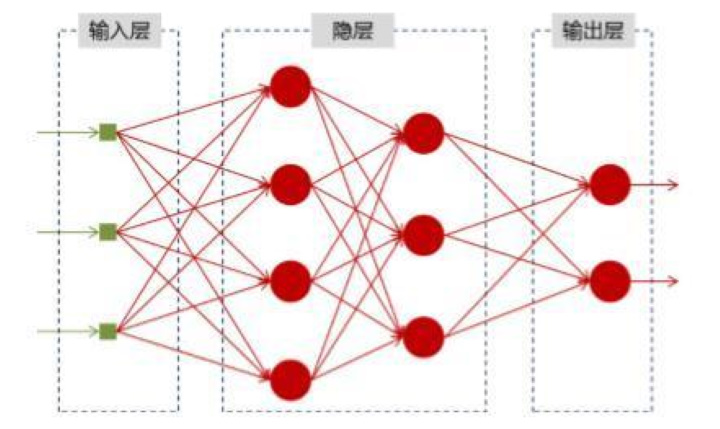

----

- 网络结构固定
- 两次计算过程相互独立

Note:
- 由输入层, 若干隐含层和一个输出层构成
- 网络结构固定对于长度不定的语言来说是一个缺陷, 自然语言文本的长度是不确定的.
- 计算过程独立, 自然语言文本的每个词与周围的词都存在的一定的关系, 前馈神经网络无法很好的捕捉这一点

---

### 循环神经网络

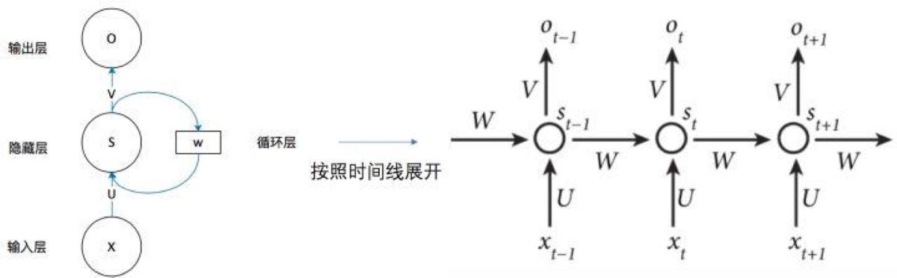

Note:
- 横向箭头表示按照时间展开

----

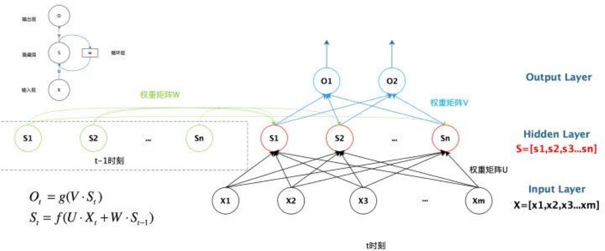

---

### 编码解码框架

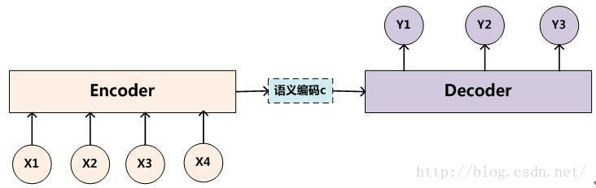

- 输入中文, 输出英文 --> 翻译系统
- 输入文章, 输出摘要 --> 文本摘要系统
- 输入问题, 输出回答 --> 问答系统

----

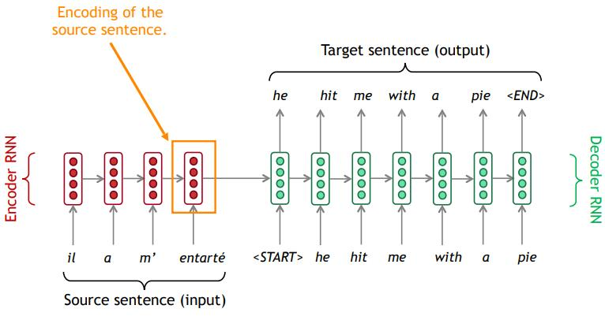

- 将所有信息压缩成固定长度的中间向量
- 输入与输出之间没有明确的对应关系
- 运算过程相互依赖, 无法并行加速

Note: 

- 如果网络比较小, 训练数据少, 这也不算是一个问题, 但如果向扩大模型的规模, 那么无法并行加速就导致网络的规模受到限制

---

### Attention机制

Note:
- 每次输入都有一个中间表示
- 每次都可以注意某一部分信息

----

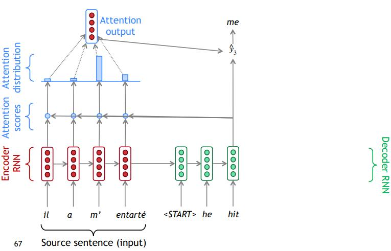

----

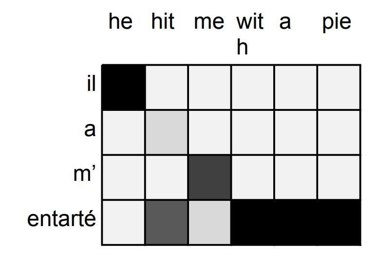

Note: 
- 每个词都可以关注输入的任何部分, 解决了信息损失的问题
- 提供了一定的可解释性

----

Attention机制就是给输入分配权重

---

### Attention机制的数学表示

$$Attention(Q,K,V) = Softmax(\frac{QK^T}{\sqrt{d_k}})V$$

----

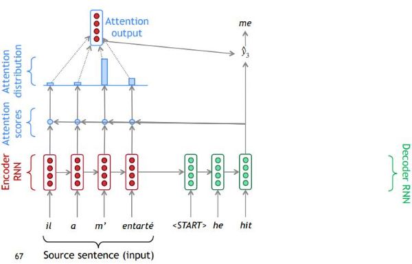

$$Attention(Q,K,V) = Softmax(\frac{QK^T}{\sqrt{d_k}})V$$

Note: 点乘只是最简单的一种方式, 不一定是点乘

---

### Self-Attention机制

$$Attention(Q,K,V) = Softmax(\frac{QK^T}{\sqrt{d_k}})V$$

---

### Transformer模型

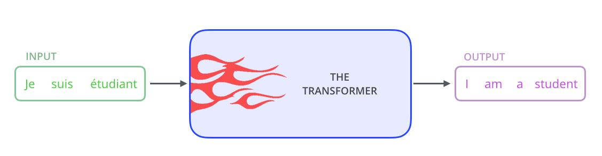

----

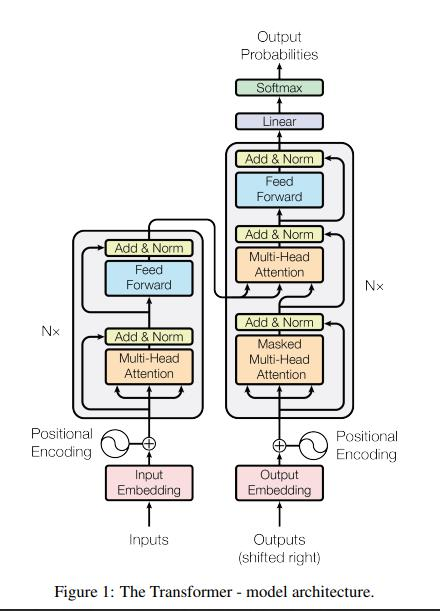

----

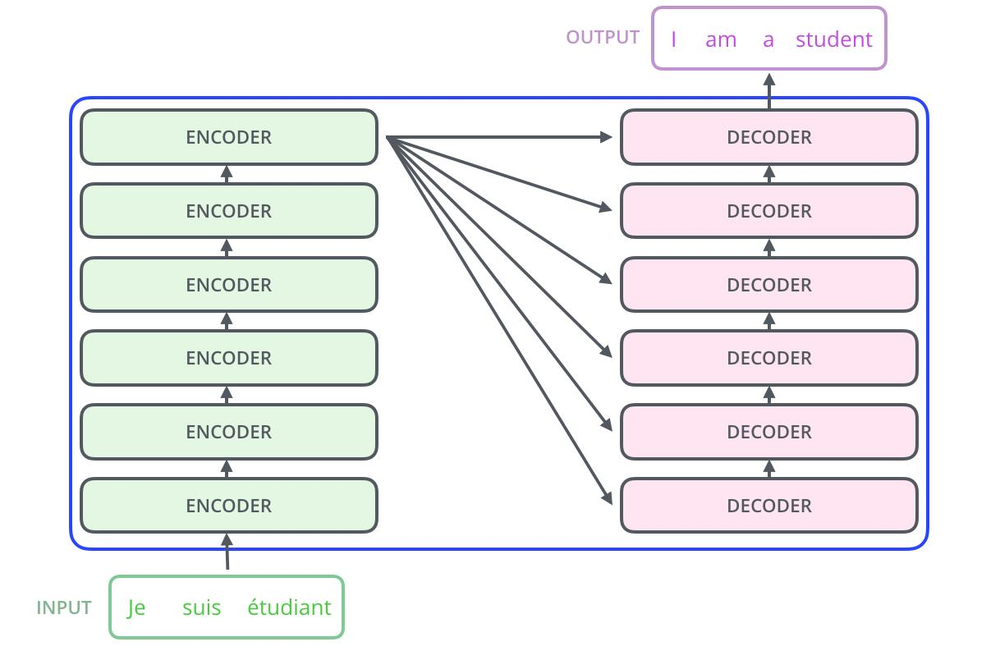

----

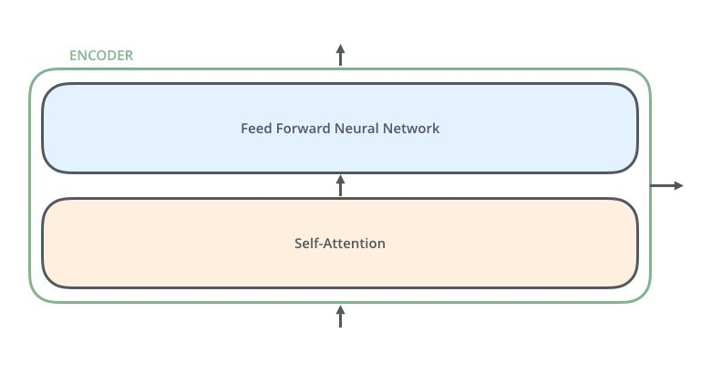

----

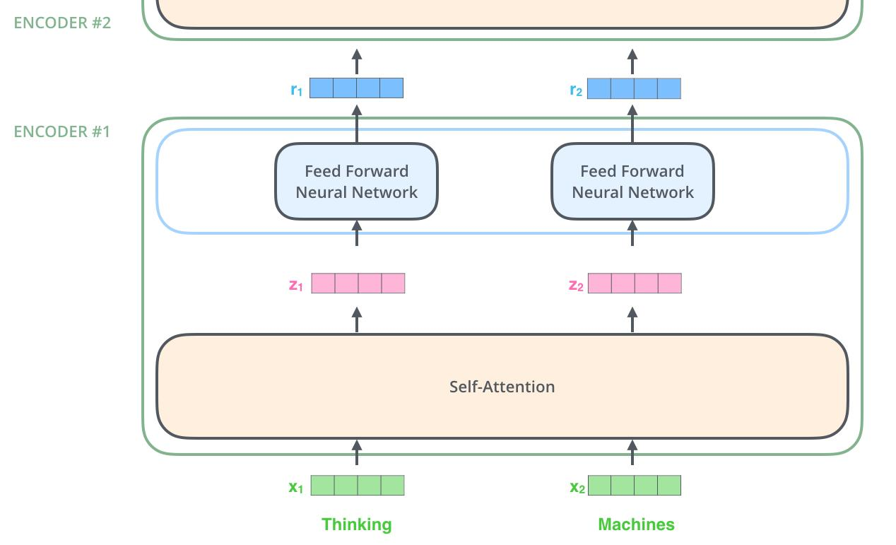

---

### Transformer计算过程

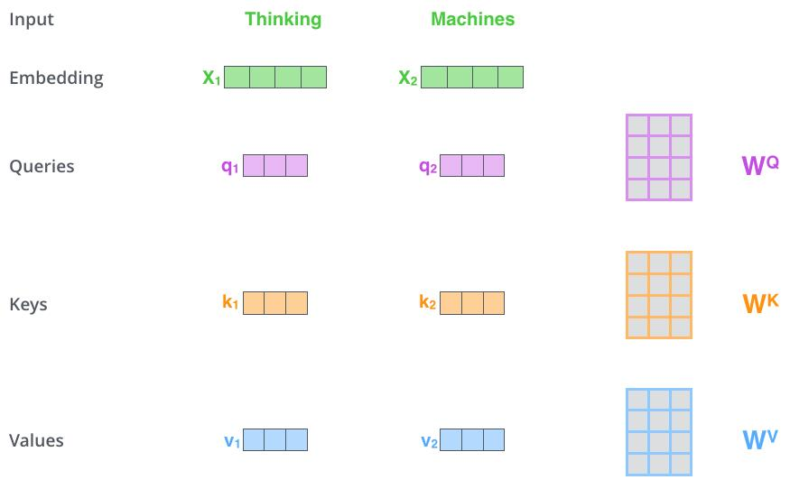

----

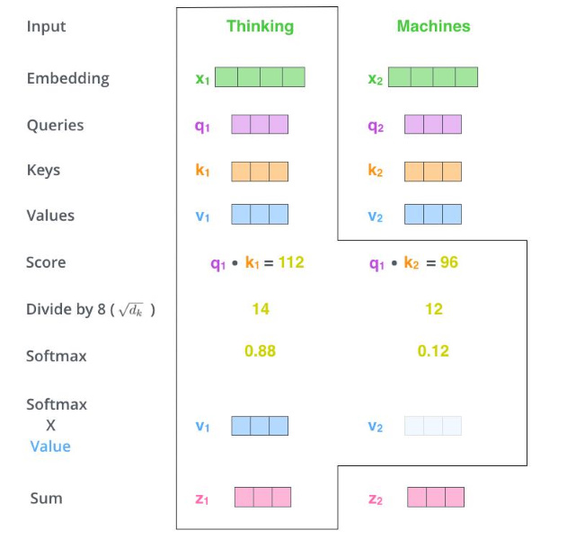

----

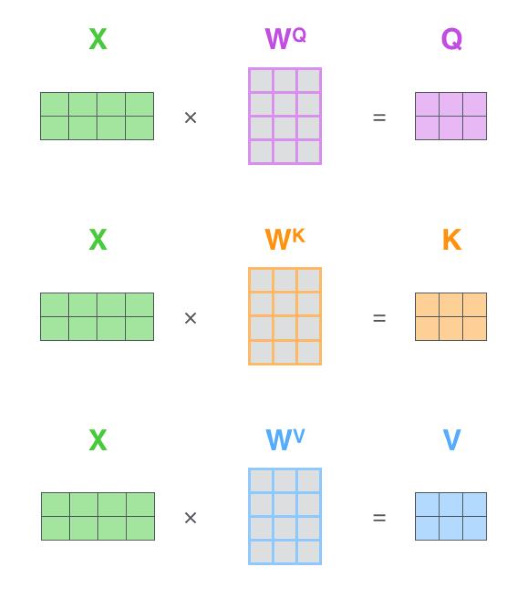

----

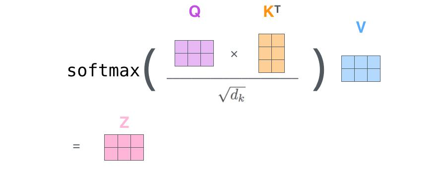

---

### Transformer的多头机制

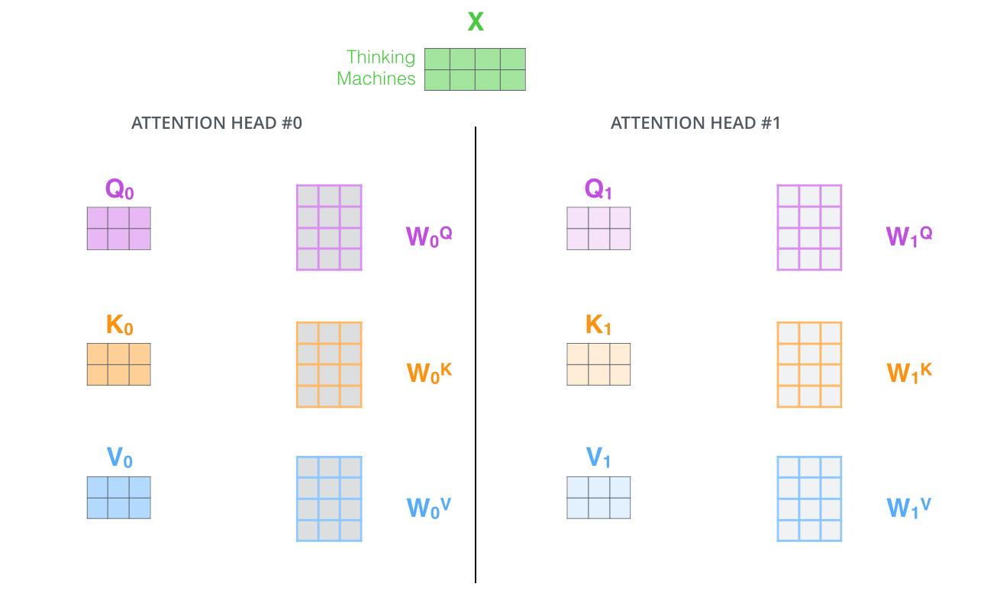

----

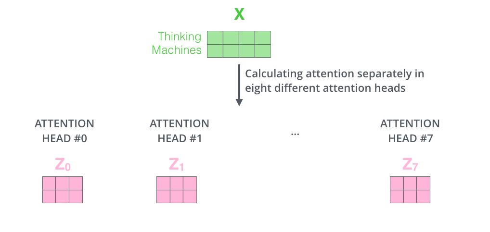

----

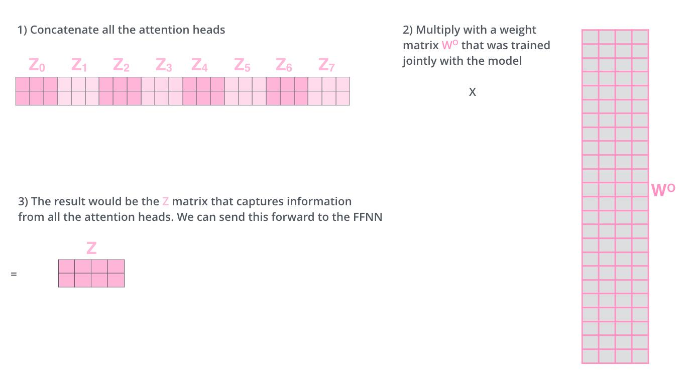

----

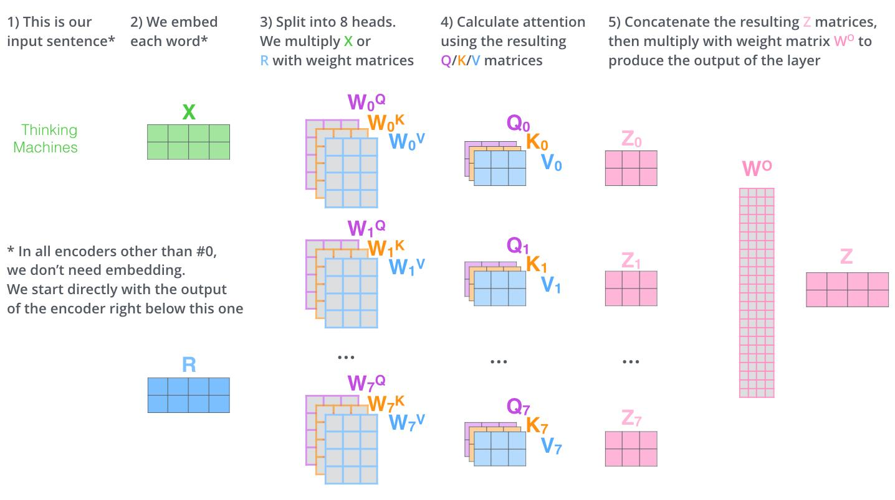

---

### 残差连接和归一化

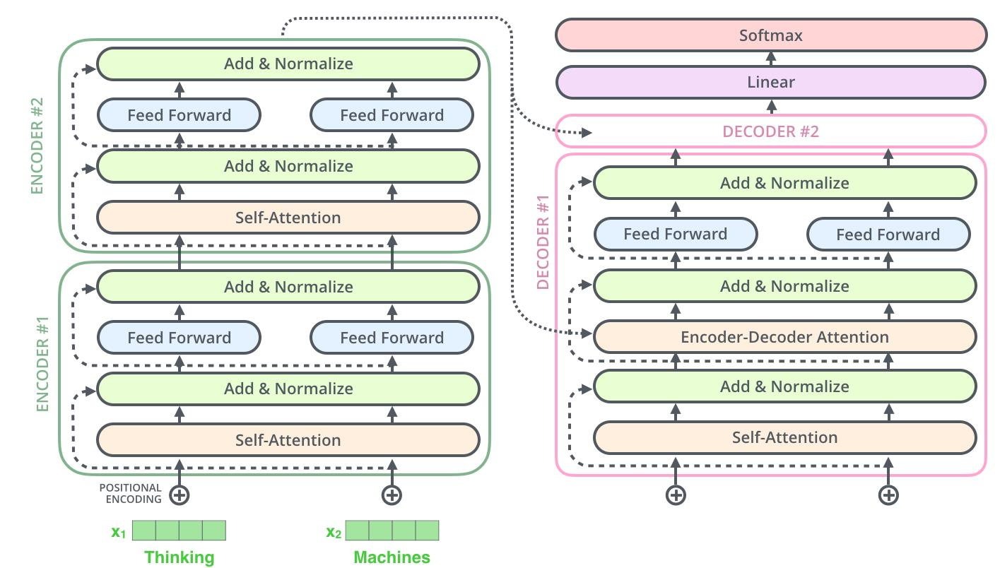

----

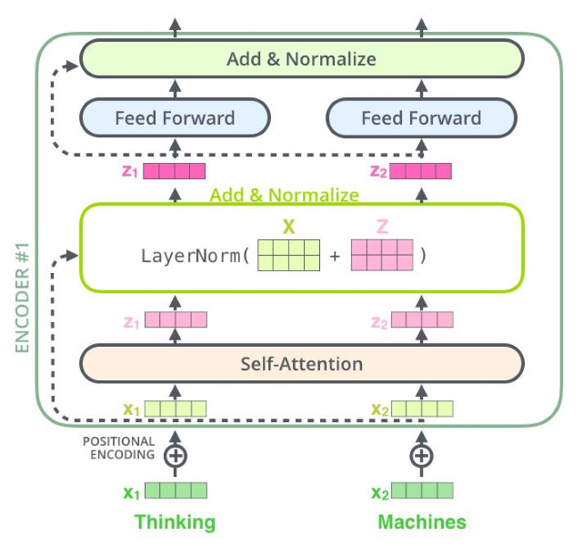

---

### Decoder结构

----

----

---

### 位置编码

Note: 抛弃了RNN架构的同时, 获得了可以并行计算的好处, 但同时又失去了输入之间相互关联的好处, 从而引入位置编码

---

### 两个问题

1. 如何理解Self-Attention
2. Transformer能不能并行计算

----

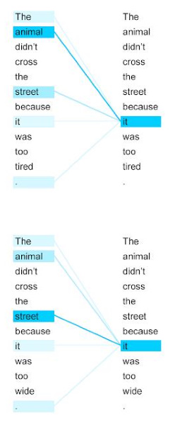

- 上下文向量

Note: 
Amazing, 上下文向量, 卷积, 底层的网络抽取细节, 高层的网络抽取语义

----

#### Teacher Forcing

---

### BERT模型

BERT: Bidirectional Encoder Representations from Transformers.

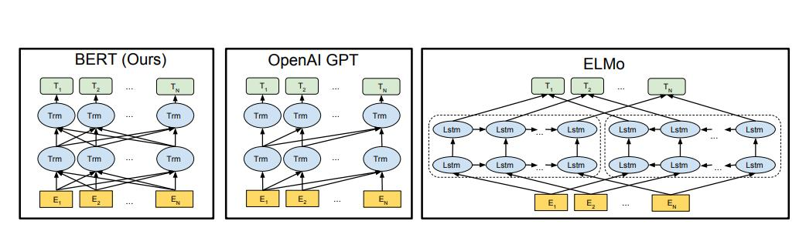

----

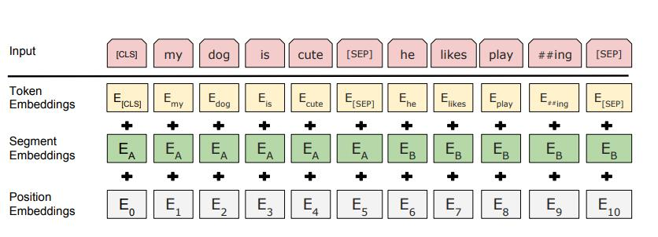

---

### 个人感受

1. Attention机制解决了信息遗忘问题
2. 位置嵌入机制解决了词语顺序信息的问题
3. Teacher Frocing技术解决了训练并行化问题
4. Self Attention提取了上下文信息
5. 多方面的获取资源: 论文, 博客, 知乎, 视频等

  
---

### 参考资料

- [The Illustrated Transformer](https://jalammar.github.io/illustrated-transformer/)
- [What is a Transformer?](https://medium.com/inside-machine-learning/what-is-a-transformer-d07dd1fbec04)
- [Self-Attention与Transformer](https://zhuanlan.zhihu.com/p/47282410)
- [More About Attention](https://zhuanlan.zhihu.com/p/106662375)