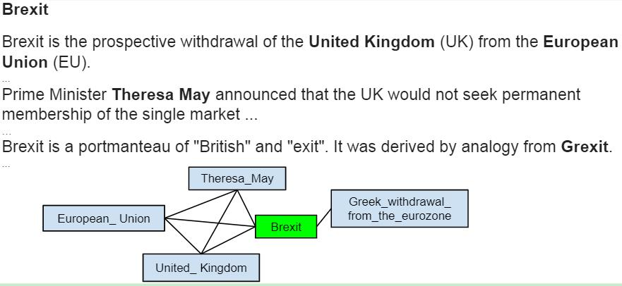

### Boosting Entity Linking Performance by Leveraging Unlabeled Documents

- Author: Phong Le and Ivan Titov
- Source: Association of Computational Linguistics
- Year  : 2019

---

### 1. Research Overview

Note:
- 为什么要做这个研究(理论走向和目前的缺陷)
- 说明论文的主要假设, 主要公式, 主要应用方式

----

### 1.1 Research Background

- Modern entity linking systems rely on large collections of documents specifically annotated for the task
- Such human-annotated resources are scarce and expensive to create

Note: human-annotated resources are available mostly for English

---

### 2 Disambiguation Model

Note:
怎么做这个研究(方法, 尤其是不同的地方)
- 这篇论文主要创意是什么
- 这些创意在应用上有什么好处
- 这些创意和应用上的好处是那些条件下才成立的

----

### 2.1 Setting

- We assume that for each mention \\( m_i \\), we are provided with a set of candidates \\(E_i^+\\)
- We assume that for each mention \\( m_i \\), we are given a set of wrong entities \\(E_i^-\\)

----

### Example

Note: 通过例子解释基础概念

----
### 2.2 Scoring Function

$$s(e_i|D)=\phi(e_i|D) + \sum_{i \neq j} \max_{e_j \in E_j^+} \varphi (e_i,e_j|D)$$

- the first term scores how well an entity fits the context, the second one judges coherence with the ‘most compatible’ candidate for each mention in the document
- This scoring strategy has been shown effective in the supervised setting by Globerson et al. (2016).

----

### 2.2 Scoring Function

$$s(e_i|D)=\phi(e_i|c_i,m_i) + \sum_{i \neq j} \alpha_{ij} \max_{e_j \in E_j^+} \varphi (e_i,e_j|D)$$

- we use \\(m_i\\) to denote an entity mention, \\(c_i\\) is its context (a text window)
- \\(\varphi (e_i,e_j|D)\\) is a pair-wise compatibility score 
- \\(\alpha_{ij}\\) are attention weights, measuring relevance of an entity at position j to predicting entity \\(e_i\\)

Note: 基本上就是一点小小的改进, 结构和以前的方法没有太大的区别

----

### 2.2 Final Scoring Function

- Ganea and Hofmann additionally exploited a simple extra feature \\(p_{wiki}(e_i|m_i)\\)
- the normalized frequency of mention \\(m_i\\) being used as an anchor text for entity \\(e_i\\) in Wikipedia articles
- We combine this score \\(p_{wiki}(e_i|m_i)\\) with the model score \\( s(e_i|D) \\) using a one-layer neural network to yield\\( \hat{s}(e_i|D) \\)

Note: 
- The anchor text, link label or link text is the visible, clickable text in an HTML hyperlink. (即超链接的文字部分)
- 这个p_{wiki}是一个重点, 后面还会提到

----

### 2.3 Objective Function

$$J(\Theta) = \sum_D \sum_{m_i} \left\[ \delta + \max_{e_i^- \in E_i^-} \hat{s}(e_i^-|D) - \max_{e_i^+ \in E_i^+} \hat{s}(e_i^+|D) \right\]_+$$

- \\(\Theta\\) is the set of model parameters, \\(\delta\\) is a margin (hyperparameter), \\(\[x\]_+ = max(0,x)\\)
- we train the model to score at least one candidate in \\(E^+_i\\) higher than any negative example from \\(E^-_i\\)

Note: 基于正负样本间隔的目标函数也是常见的一种目标函数

---

### 3. Producing Weak Supervision 

----

- We start with a set of candidates for a mention m containing all entities refereed to with anchor text m in Wikipedia
- The first step is the preprocessing technique of Ganea and Hofmann (2017). 
- The second step, we use Wikipedia to create a link graph

----

### 3.1 Initial filtering 

$$q_{wiki}(e|m,c) \propto \exp\{ x_e^T \sum_{w \in (m,c)} x_w\}$$

- Ganea use this model measuring similarity in the embedding space between an entity and words within the mention span m and a window c around it 
- \\( x_e\\) and \\( x_w\\) are external embeddings for entity e and word w

----

### 3.1 Initial filtering 

$$q_{wiki}(e|m,c) \propto \exp\{ x_e^T \sum_{w \in (m,c)} x_w\}$$

- The word and entity embeddings are not fine-tuned, so the model does not have any free parameters
- Extract \\(N_p = 4\\) top candidates according to \\(p_{wiki}\\) and \\(N_q = 3\\) top candidates according to \\(q_{wiki}\\) to get the candidate list.

Note: 
- On the development set, this step yields recall of 97.2%. 
- 使用的是外部的词嵌入, 所以所有的变量都实际上是确定值
- 因此整个计算过程也是唯一确定的, 不需要任何的训练
- 这部分是介绍Ganea and Hofmann和预处理方法, 原文没有详细介绍, 这里也不细说

----

### 3.2 Link Graph

- We construct an undirected graph from Wikipedia
- vertices of this graph are Wikipedia entities.

----

- We link vertex \\(e_u\\) with vertex \\(e_v\\) if there is a document \\(D_{wiki}\\) in Wikipedia such that either 
- \\(D_{wiki}\\) is a Wikipedia article describing \\(e_u\\), and \\(e_v\\) appears in it, or
- \\(D_{wiki}\\) contains \\(e_u\\) , \\(e_v\\) and there are less than \\(l\\) entities between them. 

Note: 一篇文章介绍e_u, 则里面所有的实体都连接, 或者两个词共同出现且间隔小于L

----

Note: 这是介绍Brexit的文章, 所以Brexit与所有的词连接, 这些词之间, 距离短的

----

### 3.3 Model and Inference

- First, we produce at most \\(N_q + N_p\\) candidates for each mention in a document D as described above
- Then we define a probabilistic model over entities in D:
$$r_{wiki}(e_1, \cdots, e_n) \propto \exp \sum_{j \neq j} \varphi_{wiki}(e_i,e_j)$$
- \\(\varphi_{wiki}(e_i,e_j) = 0\\) if \\(e_i\\) is linked with \\(e_j\\) in the graph, \\(-\Delta\\) otherwise (\\(\Delta \in R^+\\))

----

### 3.3 Model and Inference

- We use max-product version of LBP to produce approximate marginals:

$$r_{wiki}(e_1|D) \approx \max_{e_1,\cdots,e_{i-1}, \\\\ e_{i+1},\cdots,e_n} r_{wiki}(e_1, \cdots, e_n)$$

- We can reduce \\(N_p + N_q = 7\\) candidates down to \\(N_w = 2\\) and still maintain recall of 93.9%.
- The remaining \\(N_p + N_q -N _w\\) entities are kept as ‘negative-examples’ \\(E_i^-\\) for training the disambiguation model

Note:
- The general idea behined Loopy Belief Propagation (LBP) is to run Belief Propagation on a graph containing loops, despite the fact that the presence of loops does not guarantee convergence

---

### 4. Conclusions

----

1. The model was trained on unlabeled documents which were automatically annotated using Wikipedia.
2. The model rivals fully-supervised models trained on data specifically annotated for the entity-linking problem.
3. Maybe human-annotated data is not beneficial for entity linking, given that we have Wikipedia and web links

---

### 5. Future Work

----

- combine human-annotated data with naturally occurring one
- to see if mistakes made by fully-supervised systems differ from the ones made by this system and other Wikipedia-based linkers. 

---

### 6. Reading Suggestions

Note:
- 建议学长学弟什么时候参考这篇论文的那些部分
- 以及自我感受
    
    
    

