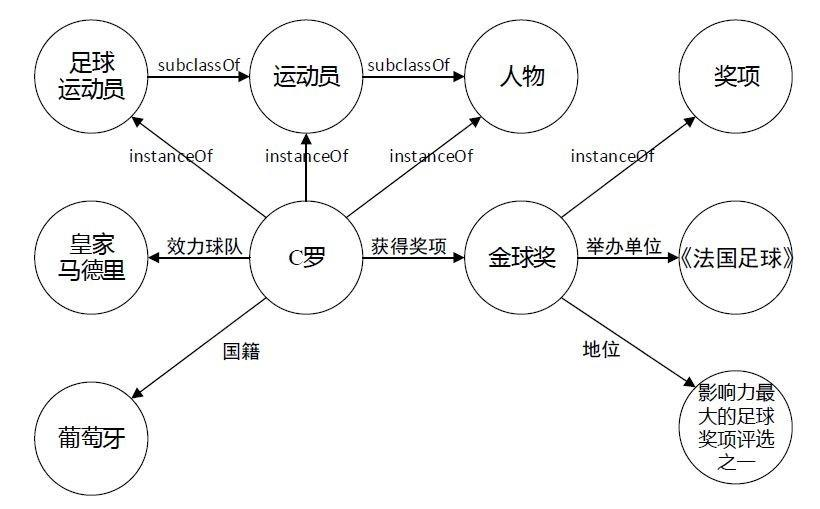
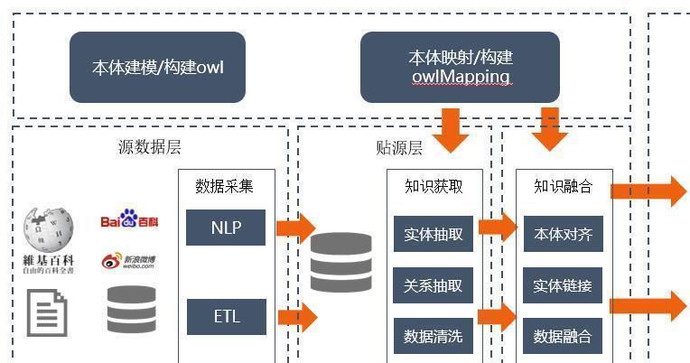
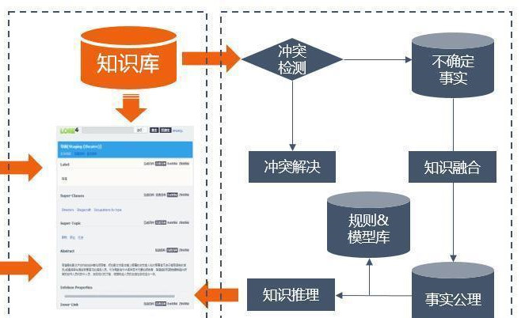
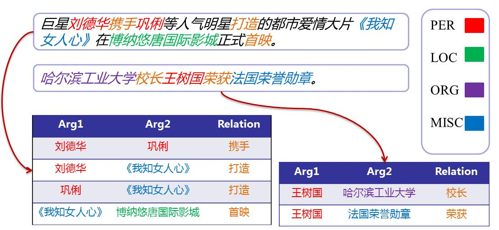
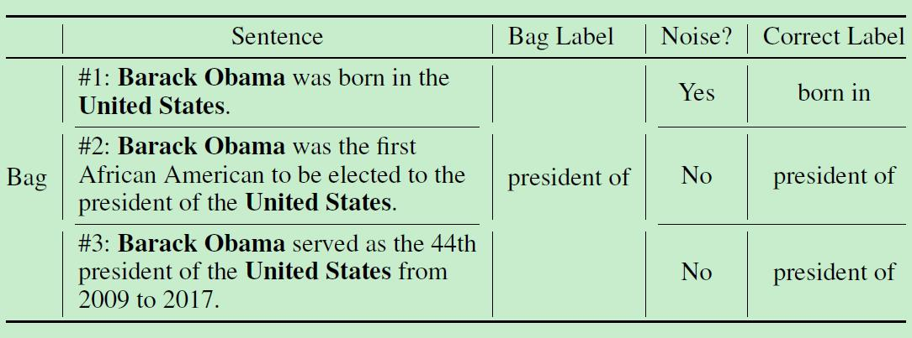
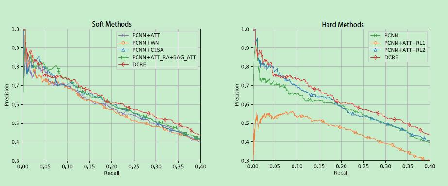

## 远程监督关系抽取概述

---

### 目录

- 知识图谱
- 关系抽取
- 远程监督

---

### 知识图谱案例: 人物与配音演员

----

### 知识图谱

---

### 构建知识图谱

----

### 构建知识图谱

---

### 什么是关系抽取

---

### 远程监督关系抽取

- 传统的机器学习方法需要人工标注数据集
- 通过**远程监督假设**自动生成训练数据

----

### 远程监督假设

----

### 远程监督假设的问题: 数据噪声多

Note: 根据提出远程监督假设的论文, 大约有30%的句子都是噪声数据

----

### 基础解决方案: 将句子构成句袋

Note: 
- 将出现的实体相同的句子构成句袋, 以句袋为单位处理数据
- 平均而言, 只能获得大约30%的正确率

---

### 远程监督效果

- [https://arxiv.org/abs/1911.09788](https://arxiv.org/abs/1911.09788)